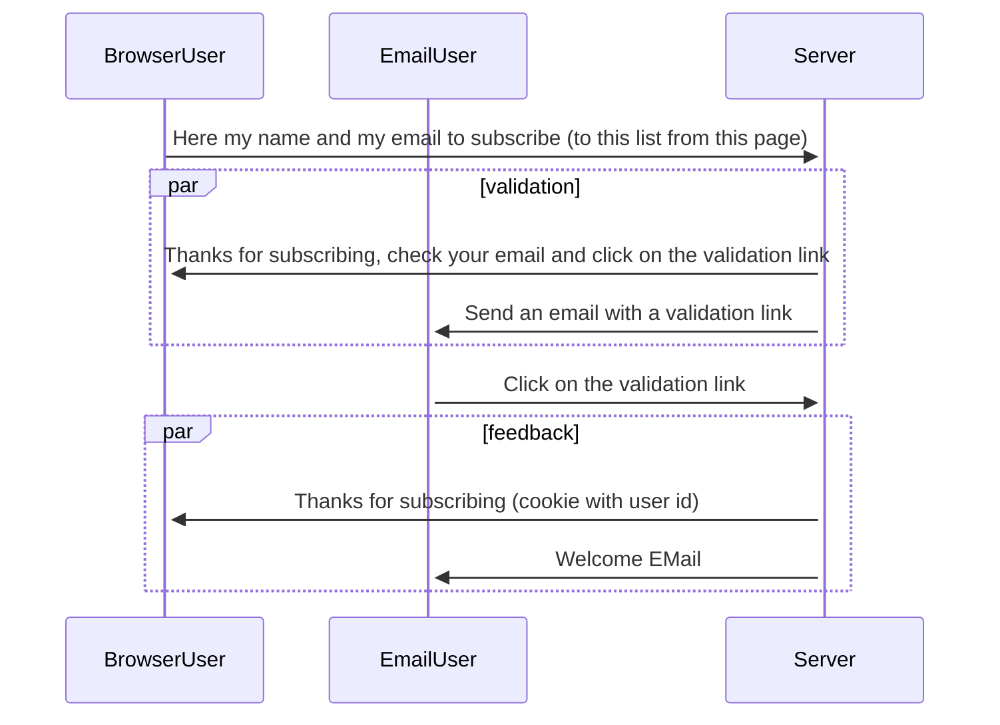

# Email list registration sequence

See [identity](member.md)

## Elements

* Signup form with recaptcha
* Signup thank you page (page seen after signup)
* Opt-in confirmation email (Validation Mail received).
* Opt-in Thank you page (After the contact clicks the confirmation email)

## Gdpr

GDPR Marketing Permissions

It's mandatory to ask you this question by law. Select all the ways you would like to hear from us:
Email

You can unsubscribe at any time by clicking the link in the footer of our emails. For information about our privacy practices, please visit the GDPR website.
